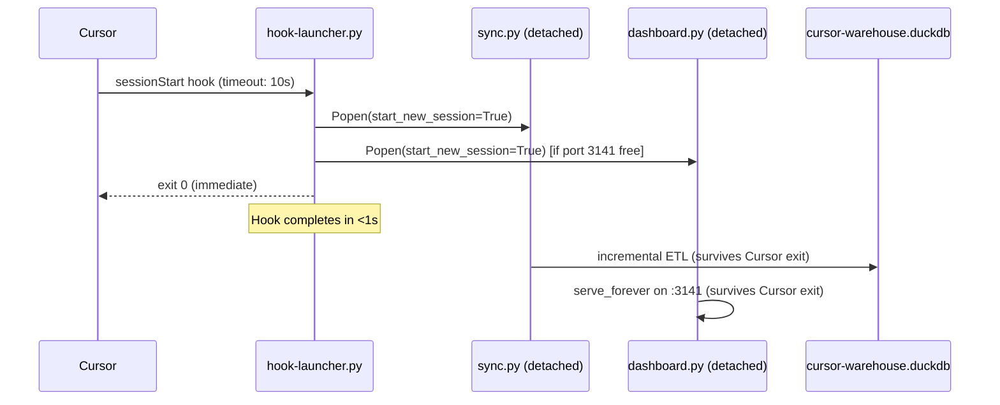

# Task: cursor-warehouse PR #1 Rework

* Task ID: visiona-pr-rework
* Complexity: Level 3
* Type: fix (rework from PR review feedback)

Address valid findings from CodeRabbit and LlamaPReview automated reviews on [PR #1](https://github.com/Texarkanine/cursor-warehouse/pull/1), plus two architectural improvements identified during review: fork-and-return hook architecture and `cw:` skill namespace prefix.

## PR Feedback Triage

### VALID AND WORTH REWORKING

#### R1. Hook architecture: fork-and-return instead of `&` backgrounding
**Source:** CodeRabbit (Major) + LlamaPReview (P1) + investigation
**Justification:** Cursor hooks run synchronously with managed timeouts and kill the process on timeout. The `&` detaches the process immediately, breaking timeout enforcement and error handling. But sync can't run synchronously either — initial sync takes 10-30+ seconds for 200+ sessions. **The upstream claude-warehouse explicitly separates sync from hooks** (sync runs via launchd cron, only dashboard is in the hook). Our solution: a thin `hook-launcher.py` that forks sync.py + dashboard.py as fully detached processes (`start_new_session=True` on POSIX, `DETACHED_PROCESS` on Windows) and returns immediately. The launcher completes within milliseconds; the forked processes survive Cursor quitting. DuckDB's write lock (already handled at sync.py line 504-508) prevents concurrent sync conflicts.

#### R2. scripts/sync.py: ON CONFLICT for scored_commits only updates 3 of 15 mutable fields
**Source:** CodeRabbit (Nitpick)
**Justification:** The upsert only updates `scored_at`, `lines_added`, `lines_deleted` on conflict. The other 12 fields (`tab_lines_added`, `tab_lines_deleted`, `composer_lines_added`, `composer_lines_deleted`, `human_lines_added`, `human_lines_deleted`, `blank_lines_added`, `blank_lines_deleted`, `commit_message`, `commit_date`, `v1_ai_percentage`, `v2_ai_percentage`) are silently dropped on re-sync. This means corrected historical data in the tracking DB won't propagate. Clear bug.

#### R3. static/index.html: XSS via innerHTML injection
**Source:** CodeRabbit (Critical)
**Justification:** `project_name`, `model`, `prompt`, and `dev_type` are data-derived fields injected unsanitized into `innerHTML`. While the attack surface is minimal (localhost dashboard, local data), this is a correctness issue and trivial to fix with an `esc()` helper. Good hygiene for a published plugin.

#### R4. scripts/embed.py: Double-prefixed source_id breaks vsearch enrichment
**Source:** CodeRabbit (Major)
**Justification:** Verified against code. `embed.py` builds source_id as `f"{sid}:{uuid}"` where `uuid` is already `session_id:line_idx` (from sync.py line 133). Result: `session_id:session_id:line_idx`. In vsearch.py `enrich()`, `source_id.split(":", 1)` extracts `sid` correctly, but then queries `m.uuid = source_id` (the full double-prefixed string), which won't match `messages.uuid` (which is `session_id:line_idx`). This breaks all vsearch enrichment metadata (project, date show as empty). Real bug.

#### R5. scripts/vsearch.py: Parameterized INTERVAL invalid DuckDB SQL
**Source:** CodeRabbit (Major)
**Justification:** Line 91: `INTERVAL ? DAY` — DuckDB requires interval literals, not parameters. This will throw a runtime error when `--days` is used. Fix: `current_date - (? * INTERVAL '1 day')`.

#### R6. static/index.html: Handle non-2xx fetch responses
**Source:** CodeRabbit (Nitpick)
**Justification:** `fetchJSON()` calls `r.json()` without checking `r.ok`. HTTP 500 errors from the dashboard API surface as opaque JSON parse errors instead of useful error messages. Trivial defensive fix.

#### R7. scripts/sync.py: Silent exception swallowing in _ingest_jsonl
**Source:** CodeRabbit (Nitpick) + LlamaPReview (P2)
**Justification:** Line 185: `except Exception: return None` silently swallows ALL errors including permission denied, I/O errors, encoding errors. A `print(... file=sys.stderr)` warning is trivial and dramatically improves debuggability for an ETL pipeline.

#### R8. scripts/sync.py: Include exception type in tracking DB failure message
**Source:** CodeRabbit (Nitpick)
**Justification:** Line 524: `except Exception as e:` should include `type(e).__name__` in the verbose message. The broad catch is intentional (maximum resilience), but logging the exception type costs nothing and helps diagnosis.

#### R9. dashboard.py + query.py: MAX(model) is non-deterministic for multi-model sessions
**Source:** CodeRabbit (Major) + LlamaPReview (P2)
**Justification:** `MAX(model)` picks the lexicographically largest model string, which is arbitrary and misleading for sessions that used multiple models. `STRING_AGG(DISTINCT model, ', ' ORDER BY model)` would be deterministic, accurate, and equally simple.

#### R10. skills/report/SKILL.md: Off-by-one bucket label
**Source:** CodeRabbit (Minor)
**Justification:** CASE expression: `message_count <= 30 → 'medium (11-30 msgs)'`, ELSE `'long (30+ msgs)'`. A 30-message session is medium, so ELSE is actually 31+. Label should be `'long (31+ msgs)'`. Genuine off-by-one.

#### R11. skills/{report,wrapped,query}/SKILL.md: Missing language tags on code fences
**Source:** CodeRabbit (Minor)
**Justification:** Three SKILL.md files have bare ``` fences for schema reference blocks. Adding `text` language tag satisfies markdownlint MD040 and is trivial.

#### R12. tests/test_sync.py: Unused variable prefixes
**Source:** CodeRabbit (Nitpick)
**Justification:** Three occurrences of unpacked-but-unused variables (`sid`, `subagents`). Prefixing with `_` signals intent. Trivial.

#### R13. Skill namespace: add `cw:` prefix to all skill names and directories
**Source:** Investigation
**Justification:** Cursor doesn't namespace plugin skills — all installed plugins share a flat skill namespace. Generic names like `query`, `recall`, `report` will collide with other plugins. Adding `cw:` prefix prevents collisions and clearly signals "cursor-warehouse" origin. Directories use hyphens (`cw-query/`), frontmatter `name:` uses colons (`cw:query`).

#### R14. New `cw:initialize` skill for first-time setup
**Source:** Investigation
**Justification:** Initial sync takes 10-30+ seconds and can't run in a hook. Users need an explicit first-time setup experience that runs `sync.py --full --verbose` interactively with progress feedback, then optionally `embed.py --verbose` for semantic search. Without this, first-time users get an empty warehouse with no guidance.

### NOT VALID AND/OR NOT WORTH REWORKING

#### N1. scripts/schema.sql: Include harness in composite primary keys
**Source:** CodeRabbit (Nitpick)
**Justification:** This is a single-harness system. The `harness` column exists as a forward-compatibility marker (documented in systemPatterns.md). Adding it to PKs would require cascading changes throughout ALL queries, ON CONFLICT clauses, and JOIN conditions for zero practical benefit — there is no second harness. Multi-harness support is explicitly VISIONB/C scope. The "collision" scenario requires a second harness emitting overlapping session UUIDs, which is astronomically unlikely even if multi-harness were implemented (UUIDs don't collide).

#### N2. static/index.html: Bucket color mapping "never matches"
**Source:** CodeRabbit (Minor)
**Justification:** **False positive.** CodeRabbit confused the report SKILL.md SQL (which uses descriptive labels like `'abandoned (1-3 msgs)'`) with the dashboard API SQL. The actual `dashboard.py` `api_efficiency()` returns bare labels: `'abandoned'`, `'short'`, `'medium'`, `'long'` — which perfectly match the `bucketColors` keys. No fix needed.

#### N3. scripts/vsearch.py: ANN LIMIT before filtering drops valid matches
**Source:** CodeRabbit (Major)
**Justification:** The 3x oversampling (`LIMIT limit * 3`) before post-filtering by project/days is a standard pattern for ANN search with post-filters. Adding project/days filters inside the SQL would require expensive JOINs that prevent HNSW index usage. Iterative paging adds significant complexity for marginal benefit in a local analytics tool. Acceptable tradeoff for v0.1.

#### N4. scripts/dashboard.py: Unused AI attribution endpoint
**Source:** LlamaPReview (P2)
**Justification:** Intentional. The `api_ai_attribution` endpoint was built to serve the API for skills and external consumers. The frontend chart is VISIONB scope. The endpoint is not dead code — it's a completed API surface that the frontend will consume later. Skills already reference `scored_commits` data.

#### N5. scripts/query.py: Inefficient model subquery performance
**Source:** LlamaPReview (P2)
**Justification:** Premature optimization. The dataset is local (typically <500 sessions). DuckDB handles this subquery efficiently via hash aggregation. Materializing model info into the sessions table during sync adds sync complexity and creates a second source of truth. Not worth the coupling for a local analytics tool.

#### N6. scripts/sync.py: Per-conversation model UPDATE round-trips
**Source:** LlamaPReview (P2)
**Justification:** The model enrichment loop (~150-200 iterations for a typical user) completes in <100ms on DuckDB. A batch UPDATE via temp table would be cleaner but adds code complexity for negligible performance gain. Not blocking for v0.1.

#### N7. scripts/dashboard.py: CORS wildcard Access-Control-Allow-Origin: *
**Source:** CodeRabbit (inline)
**Justification:** This is a localhost-only dashboard (`127.0.0.1:3141`) serving local data. Restricting CORS adds complexity with zero security benefit — any process on localhost can already read the DuckDB file directly. The wildcard enables useful integrations (e.g., a Cursor webview panel fetching from the dashboard API).

#### N8. memory-bank/: Various doc cleanup (reflection stale text, hooks naming, VISIONA language tags)
**Source:** CodeRabbit (various)
**Justification:** Memory-bank files are development process documents, not shipped code. The reflection accurately captured the state at writing time. The hooks naming "conflict" is already explained in context (hooks.json is the source, .cursor/hooks.json is the install target). VISIONA.md language tags are cosmetic. None affect functionality or user experience.

## Pinned Info

### Hook Architecture (fork-and-return)

Why: Cursor kills hook processes on timeout. Initial sync is too slow for synchronous hooks. Upstream claude-warehouse uses cron for sync, not hooks. Our approach: a thin launcher that forks detached processes and returns immediately.



### Skill Namespace Mapping

| Old Dir | Old Name | New Dir | New Name |
|---|---|---|---|
| `skills/query/` | `query` | `skills/cw-query/` | `cw:query` |
| `skills/recall/` | `recall` | `skills/cw-recall/` | `cw:recall` |
| `skills/report/` | `report` | `skills/cw-report/` | `cw:report` |
| `skills/wrapped/` | `wrapped` | `skills/cw-wrapped/` | `cw:wrapped` |
| *(new)* | — | `skills/cw-initialize/` | `cw:initialize` |

## Component Analysis

### Affected Components

- **`scripts/hook-launcher.py`** (NEW): Thin sessionStart hook launcher — forks sync.py + dashboard.py as detached processes, returns immediately. ~25 lines. Cross-platform (`start_new_session` on POSIX, `DETACHED_PROCESS` on Windows).
- **`hooks/hooks.json`**: Hook configuration → replace two `&`-backgrounded hooks with single `hook-launcher.py` call (no `&`, short timeout)
- **`scripts/sync.py`**: ETL pipeline → fix scored_commits upsert, add error logging, improve exception messages
- **`scripts/embed.py`**: Embedding pipeline → fix double-prefixed source_id
- **`scripts/vsearch.py`**: Vector search → fix INTERVAL SQL syntax
- **`scripts/dashboard.py`**: HTTP dashboard → fix MAX(model) to deterministic summary
- **`scripts/query.py`**: CLI query → fix MAX(model) to deterministic summary
- **`static/index.html`**: Dashboard frontend → add XSS escaping, handle non-2xx responses
- **`skills/cw-query/SKILL.md`** (RENAMED): Add `cw:` prefix, add language tag to code fence
- **`skills/cw-recall/SKILL.md`** (RENAMED): Add `cw:` prefix
- **`skills/cw-report/SKILL.md`** (RENAMED): Add `cw:` prefix, fix off-by-one label, add language tag
- **`skills/cw-wrapped/SKILL.md`** (RENAMED): Add `cw:` prefix, add language tag
- **`skills/cw-initialize/SKILL.md`** (NEW): First-time setup skill — guides running sync.py --full, embed.py, and dashboard.py
- **`tests/test_sync.py`**: Tests → prefix unused variables
- **`.cursor-plugin/plugin.json`**: Update skills path reference if needed (currently `"./skills/"` — should still work since we're renaming dirs not the parent)

### Cross-Module Dependencies

- `embed.py` source_id fix (R4) must match `vsearch.py` enrichment logic
- `embed.py` source_id fix (R4) must match `count_unembedded()` and `clean_stale_embeddings()` queries
- `hook-launcher.py` (R1) must find `sync.py` and `dashboard.py` relative to itself
- Skill rename (R13) must be reflected in any cross-references between skills, README, and plugin.json
- `cw:initialize` skill (R14) must reference correct script paths via `${CURSOR_PLUGIN_ROOT}`

### Boundary Changes

- `embed.py` embeddings.source_id format changes from `session_id:session_id:line_idx` to `session_id:line_idx` — existing embeddings will become stale and be cleaned up on next `embed.py --full` run
- Hook commands change completely — single launcher replaces two backgrounded scripts
- Skill names change — users referencing old names (`query`, `recall`, etc.) will need to use `cw:query`, `cw:recall`, etc.

### Invariants & Constraints

1. All existing 53 tests must continue passing
2. No new external dependencies (subprocess, socket, sys, os are stdlib)
3. Backward compatibility: existing embeddings cleaned gracefully (not crash)
4. Hook launcher must be cross-platform (POSIX + Windows)
5. Forked processes must survive Cursor exit (fully detached)
6. DuckDB write lock prevents concurrent sync conflicts (already handled)

## Open Questions

None — all rework items have clear implementations.

## Test Plan (TDD)

### Behaviors to Verify

**R2 (scored_commits upsert):**
- Re-syncing scored_commits with changed tab/human/AI% values → all fields update
- Existing test `test_scored_commits_dedup` may need enhancement

**R4 (embed source_id):**
- Message embedding source_id matches vsearch enrichment lookup
- Stale embeddings with old double-prefixed IDs are cleaned on next run
- Unit test: `embed_messages` produces source_ids matching `messages.uuid` format (no double-prefix)

**R5 (vsearch INTERVAL):**
- `--days` filter works without SQL error
- Unit test: `--days` filter SQL executes without error against DuckDB

**R7 (ingest error logging):**
- Malformed file produces stderr warning (not silent skip)

**R1 (hook launcher):**
- Launcher script exits 0 immediately
- Forked processes are detached (no zombie, survives parent exit)

### Test Infrastructure

- Framework: pytest
- Run command: `uv run --with pytest --with duckdb pytest tests/ -v`
- Test location: `tests/`
- Modified test files: `tests/test_sync.py` (existing tests + R2 enhancement + R4 embed source_id test + R5 INTERVAL test)
- No new test files needed — hook launcher and skills are integration-tested via smoke test

### New Unit Tests

- R4: Verify `embed_messages` source_id format matches `messages.uuid` (no double session_id prefix)
- R5: Verify `--days` INTERVAL SQL executes without error against a real DuckDB connection

### Integration Tests

- Existing full sync integration tests cover R2 (scored_commits)
- R1 requires manual verification (hook-launcher.py spawns processes correctly)

## Implementation Plan

### Phase 1: Bug fixes (scripts)

1. **Fix scored_commits upsert to update ALL mutable fields (R2)**
    - Files: `scripts/sync.py`
    - Changes: Expand ON CONFLICT DO UPDATE SET to include all 12 additional mutable columns
    - TDD: Enhance `test_scored_commits_dedup` to verify all fields update on re-sync

2. **Fix embed.py double-prefixed source_id (R4)**
    - Files: `scripts/embed.py`, `scripts/sync.py`
    - Changes: In `embed_messages()` and `count_unembedded()` and `clean_stale_embeddings()`, change source_id from `f"{sid}:{uuid}"` to just `uuid` (since uuid already contains session_id prefix). Update all `m.session_id || ':' || m.uuid` SQL concatenations to just `m.uuid`.
    - Also: Add format-contract comment on `msg_uuid = f"{session_id}:{line_idx}"` in `sync.py` (line 133) documenting that this format is consumed by `embed.py` source_id and `vsearch.py` enrichment.
    - TDD: Add unit test verifying `embed_messages` produces source_ids that match the `messages.uuid` column format (no double-prefix)

3. **Fix vsearch.py parameterized INTERVAL (R5)**
    - Files: `scripts/vsearch.py`
    - Changes: Line 91: change `INTERVAL ? DAY` to `? * INTERVAL '1 day'`
    - TDD: Add unit test verifying `--days` filter SQL executes without error against a DuckDB connection

4. **Fix MAX(model) to deterministic summary (R9)**
    - Files: `scripts/dashboard.py`, `scripts/query.py`
    - Changes: Replace `MAX(model)` with `STRING_AGG(DISTINCT model, ', ' ORDER BY model)` in both files' model subqueries

5. **Add error logging to _ingest_jsonl (R7)**
    - Files: `scripts/sync.py`
    - Changes: Line 185: `except Exception as e: print(f"[sync] Skipping {fp}: {type(e).__name__}: {e}", file=sys.stderr); return None`

6. **Include exception type in tracking DB failure message (R8)**
    - Files: `scripts/sync.py`
    - Changes: Line 526: add `type(e).__name__` to the verbose message

### Phase 2: Frontend fixes

7. **Add XSS escaping to innerHTML injections (R3)**
    - Files: `static/index.html`
    - Changes: Add `esc()` function that escapes `&`, `<`, `>`, `"`, `'`. Apply to: `project_name`, `model`, `prompt` in sessions table; `dev_type`, `top_tool`, `project_name` in wrapped section.

8. **Handle non-2xx fetch responses (R6)**
    - Files: `static/index.html`
    - Changes: Add `if (!r.ok)` check in `fetchJSON()` before calling `r.json()`

### Phase 3: Hook architecture (R1)

9. **Create hook-launcher.py**
    - Files: `scripts/hook-launcher.py` (NEW)
    - Changes: ~25-line script. Finds `sync.py` and `dashboard.py` relative to `__file__`. Spawns each as a fully detached process via `subprocess.Popen`. Cross-platform: `start_new_session=True` on POSIX, `creationflags=DETACHED_PROCESS` on Windows. Checks port 3141 before spawning dashboard. All child stdio redirected to `DEVNULL`. Exits 0 immediately.
    - PEP 723 header: `requires-python = ">=3.11"`, no external dependencies (stdlib only: `subprocess`, `socket`, `sys`)

10. **Update hooks.json**
    - Files: `hooks/hooks.json`
    - Changes: Replace two backgrounded hook entries with single launcher:
      ```json
      {
        "version": 1,
        "hooks": {
          "sessionStart": [{
            "matcher": ".*",
            "hooks": [{
              "type": "command",
              "command": "uv run --script ${CURSOR_PLUGIN_ROOT}/scripts/hook-launcher.py",
              "timeout": 10000
            }]
          }]
        }
      }
      ```

### Phase 4: Skill namespace rename (R13) + initialize skill (R14)

11. **Rename skill directories and update frontmatter**
    - Delete old dirs, create new dirs with renamed SKILL.md files:
      - `skills/query/` → `skills/cw-query/` (name: `cw:query`)
      - `skills/recall/` → `skills/cw-recall/` (name: `cw:recall`)
      - `skills/report/` → `skills/cw-report/` (name: `cw:report`)
      - `skills/wrapped/` → `skills/cw-wrapped/` (name: `cw:wrapped`)
    - Update frontmatter `name:` field in each SKILL.md
    - Apply R10 (off-by-one label), R11 (language tags) during the rename

12. **Create `cw:initialize` skill**
    - Files: `skills/cw-initialize/SKILL.md` (NEW)
    - Content: First-time setup skill that guides the agent to:
      1. Run `${CURSOR_PLUGIN_ROOT}/scripts/sync.py --full --verbose` for initial data import
      2. Report sync results (sessions, messages, tool calls, scored commits)
      3. Optionally run `${CURSOR_PLUGIN_ROOT}/scripts/embed.py --verbose` for semantic search
      4. Optionally run `${CURSOR_PLUGIN_ROOT}/scripts/dashboard.py &` to start the dashboard
      5. Confirm the warehouse is ready

13. **Update cross-references**
    - Files: `README.md`, `.cursor-plugin/plugin.json`
    - Changes: Update any skill name references in README (if present). Verify plugin.json `"skills": "./skills/"` still discovers the renamed directories (it should — it scans `*/SKILL.md` recursively).

### Phase 5: Code hygiene

14. **Prefix unused test variables (R12)**
    - Files: `tests/test_sync.py`
    - Changes: `sid` → `_sid` (lines 119, 203), `subagents` → `_subagents` (line 314)

### Phase 6: Verification

15. **Run full test suite**
    - `uv run --with pytest --with duckdb pytest tests/ -v`
    - All 53+ tests must pass

16. **Manual smoke tests**
    - `uv run --script scripts/sync.py -v` — verify error logging on any malformed files
    - `uv run --script scripts/hook-launcher.py` — verify exits immediately, spawns detached processes
    - Verify vsearch.py with `--days` flag doesn't crash (R5)
    - Verify skills are discoverable with `cw:` prefix

## Technology Validation

No new external technology. `hook-launcher.py` uses only Python stdlib (`subprocess`, `socket`, `sys`). The `start_new_session` parameter and `DETACHED_PROCESS` creation flag are stable, documented Python APIs.

## Challenges & Mitigations

- **R4 (embed source_id) breaks existing embeddings**: Existing embeddings in the DB have double-prefixed source_ids. `clean_stale_embeddings()` will detect them as stale (no matching message) and clean them on next `embed.py` run. New embeddings will use correct single-prefix IDs. No migration needed — the stale cleanup mechanism handles it.
- **R1 (hook launcher cross-platform)**: `start_new_session=True` works on POSIX (Linux, macOS, WSL). Windows requires `creationflags=DETACHED_PROCESS`. The launcher checks `sys.platform` to choose the right approach. Both are well-documented Python stdlib features.
- **R1 (uv availability for launcher)**: The launcher is invoked via `uv run --script`, which means uv must be installed. This is already a prerequisite for the entire plugin (documented in README). If uv is missing, the hook fails gracefully (Cursor logs the error but continues).
- **R9 (STRING_AGG model)**: Changing from `MAX(model)` to `STRING_AGG(DISTINCT model, ', ')` may produce longer strings for multi-model sessions. The dashboard and CLI already truncate model display, so this is safe.
- **R13 (skill rename)**: Users who bookmarked or memorized old skill names will need to use `cw:` prefix. This is pre-v1.0 software with no existing marketplace users, so breaking the old names is fine.
- **R14 (initialize skill)**: The skill runs sync interactively, which could take 30+ seconds for large histories. The skill document should set expectations about wait time and provide progress indicators via `--verbose`.

## Status

- [x] PR feedback triage complete (14 valid, 8 rejected)
- [x] Hook architecture investigation complete (fork-and-return chosen)
- [x] Skill namespace decision complete (`cw:` prefix)
- [x] Component analysis complete
- [x] Open questions resolved (none)
- [x] Test planning complete (TDD)
- [x] Implementation plan complete (16 steps across 6 phases)
- [x] Technology validation complete (stdlib only)
- [x] Preflight
- [x] Build
- [x] QA
