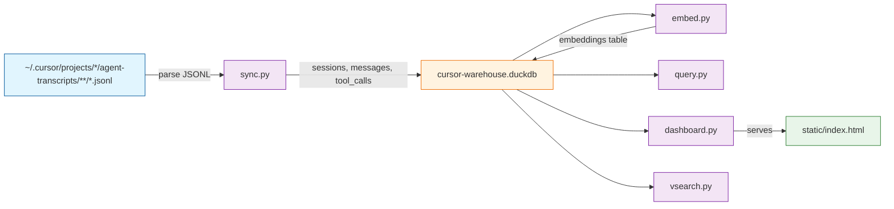
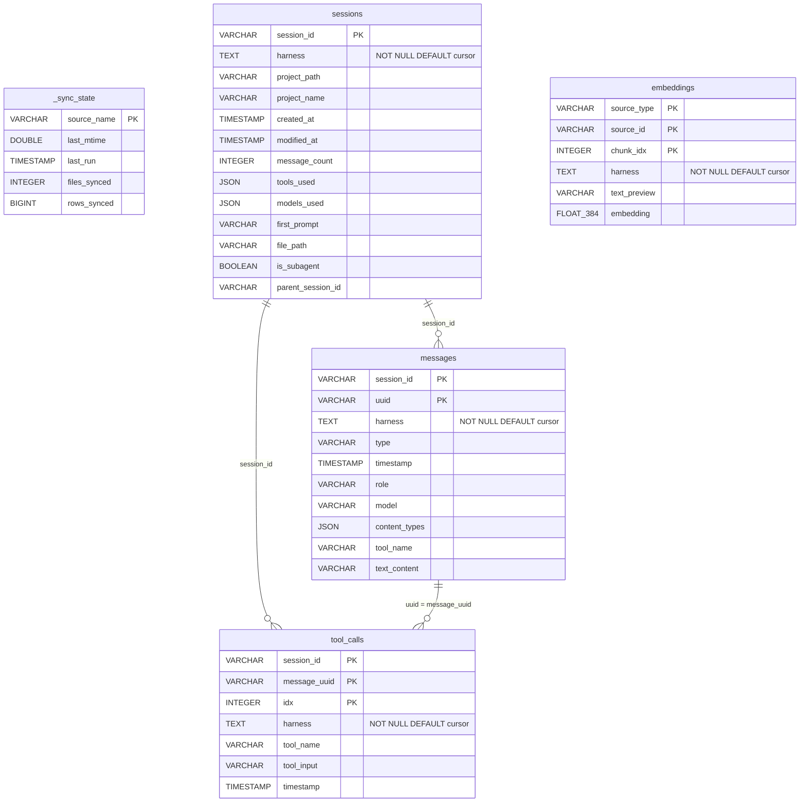

# Task: cursor-warehouse VISIONA Port

* Task ID: visiona-port
* Complexity: Level 3
* Type: feature (direct fork/port)

Port [claude-warehouse](https://github.com/sderosiaux/claude-warehouse) (MIT) to read Cursor agent transcript data instead of Claude Code data. Copy upstream source, modify JSONL parser, adapt scripts, add `harness` column, and package as a Cursor plugin.

## Pinned Info

### Data Flow

Architecture overview — how Cursor transcript data flows through the system.

### Modified Schema (ER)

Cursor-warehouse retains 4 of the upstream's 9 data tables plus the watermark table. All provenance tables gain a `harness` column.

### Cursor JSONL Format vs Claude Code

Key differences that drive the sync.py rewrite:

| Aspect | Claude Code | Cursor |
|--------|-------------|--------|
| Top-level type field | `type` ("user", "assistant") | `role` ("user", "assistant") |
| Message UUID | `uuid` per record | **None** — generate as `{session_id}:{line_number}` |
| Timestamps | `timestamp` per message | **None** — use file mtime for session timestamps |
| Token usage | `message.usage.*` | **None** — leave as 0/NULL |
| Session ID source | `sessionId` field in records | Directory name (UUID from path) |
| Discovery path | `~/.claude/projects/**/*.jsonl` | `~/.cursor/projects/*/agent-transcripts/**/*.jsonl` |
| Content blocks | `message.content[]` | `message.content[]` (identical) |
| Subagent detection | `/subagents/` in path | `/subagents/` in path (identical) |
| Sidechain | `isSidechain` field | **None** |
| Model | `message.model` | **None** |

## Component Analysis

### Affected Components

- **`scripts/schema.sql`**: DuckDB DDL → drop 5 Claude-specific tables (`deleted_sessions`, `hook_events`, `todos`, `debug_logs`, `research_history`), add `harness` column to 4 tables
- **`scripts/sync.py`**: JSONL ETL pipeline → **main rewrite**: change discovery path, rewrite JSONL parser for Cursor format, remove 6 Claude-specific sync functions, add harness support
- **`scripts/query.py`**: CLI query interface → update DB_PATH, rename prog, remove `hooks` command, remove research_history from search, adapt tokens/size for no-token-data
- **`scripts/dashboard.py`**: HTTP dashboard server → update DB_PATH, remove/repurpose cost endpoints, remap tool names in trends/wrapped, update type_map for Cursor tools
- **`scripts/embed.py`**: Vector embedding generator → update DB_PATH, remove research embedding pipeline, adapt stale cleanup (no research_history)
- **`scripts/vsearch.py`**: Semantic vector search → update DB_PATH, remove research source type
- **`static/index.html`**: Dashboard frontend → rebrand to cursor-warehouse, remove/adapt cost UI sections
- **`.cursor-plugin/plugin.json`**: Plugin manifest (NEW, replaces `.claude-plugin/`)
- **`.cursor/hooks.json`**: Session hooks (NEW, Cursor uses `.cursor/hooks.json` not `hooks/hooks.json`)
- **`skills/`**: Agent skills → port 4 skills (query, recall, report, wrapped), remove costs skill, update all references
- **`README.md`**: Project documentation → rewrite for cursor-warehouse, credit upstream
- **`.gitignore`**: Copy from upstream as-is
- **`LICENSE`**: MIT license file (NEW)

### Cross-Module Dependencies

- `sync.py` → `schema.sql`: executes DDL to init DB
- `query.py`, `dashboard.py`, `embed.py`, `vsearch.py` → DB tables defined in `schema.sql`
- `embed.py` → `schema.sql`: also inits DB + manages HNSW index
- `dashboard.py` → `static/index.html`: serves static files
- `query.py` → `vsearch.py`: delegates `vsearch` subcommand
- Skills → scripts: skills reference script paths via `${CURSOR_PLUGIN_ROOT}/scripts/`

### Boundary Changes

- **Schema**: 5 tables dropped, `harness` column added to 4 tables
- **Sessions table**: drops `git_branch`, `version`, `cwd`, token columns (set to 0/NULL since Cursor doesn't provide them)
- **Messages table**: drops `parent_uuid`, `is_sidechain` (set to NULL/FALSE), token columns
- **CLI**: `hooks` command removed, prog renamed from `cw` to `cursor-warehouse`
- **Dashboard API**: `/api/costs` repurposed as session-count-by-project (no token cost data)

### Invariants & Constraints

1. MIT license preserved on all ported files
2. PEP 723 script pattern preserved (`uv run --script`)
3. DuckDB as warehouse engine (unchanged)
4. sentence-transformers + torch for embeddings (unchanged)
5. Chart.js dashboard (unchanged)
6. HTTP server on port 3141 (unchanged)
7. HNSW index for vector similarity (unchanged)
8. `harness` column defaults to `'cursor'` on all provenance tables
9. No pyproject.toml / uv.lock (VISION2 scope)

## Open Questions

None — implementation approach is clear. VISIONA provides detailed specifications for every component. The Cursor JSONL format has been verified against actual transcript data.

## Test Plan (TDD)

### Behaviors to Verify

**Schema (`test_schema.py`):**
- Schema DDL executes without error on fresh DuckDB
- Tables `_sync_state`, `sessions`, `messages`, `tool_calls`, `embeddings` exist
- Tables `deleted_sessions`, `hook_events`, `todos`, `debug_logs`, `research_history` do NOT exist
- `harness` column exists with default `'cursor'` on `sessions`, `messages`, `tool_calls`, `embeddings`

**Sync — JSONL Parser (`test_sync.py`):**
- Cursor JSONL with `role` field (not `type`) is parsed correctly
- Message UUIDs generated as `{session_id}:{line_number}` are stable and deterministic
- Session ID derived from directory name (UUID from path)
- `message.content[]` text blocks extracted correctly
- `message.content[]` tool_use blocks extracted into tool_calls table
- Token counts default to 0 (not available in Cursor)
- `harness` column set to `'cursor'` on all inserted rows
- Subagent detection via `/subagents/` path works
- Parent session ID derived from subagent path structure
- Empty JSONL files handled gracefully (no crash, no rows)
- Malformed JSON lines skipped without crash
- First user prompt extracted correctly for session summary

**Sync — Discovery (`test_sync.py`):**
- `_scan_jsonl_files()` finds files under `agent-transcripts/` structure
- Watermark system filters out already-processed files
- Multiple workspace slugs are discovered

**Sync — Removed Functions:**
- No `sync_deleted_sessions`, `sync_hook_events`, `sync_todos`, `sync_debug`, `sync_history`, `purge_synced_files` functions exist

**Edge cases:**
- JSONL file with only assistant messages (no user turn) → still creates session
- JSONL with 0 bytes → skip gracefully
- Session with content blocks that are plain strings (not dicts)
- Very long text_content → truncated to 2000 chars

### Test Infrastructure

- Framework: pytest
- Run command: `uv run --with pytest --with duckdb pytest tests/ -v`
- Test location: `tests/`
- Fixtures: `tests/fixtures/` with sample Cursor JSONL files
- New test files:
  - `tests/conftest.py` — adds `scripts/` to `sys.path`, provides DuckDB fixtures
  - `tests/test_schema.py` — schema validation
  - `tests/test_sync.py` — JSONL parser and sync flow

### Integration Tests

- **Full sync flow**: Create temp directory mimicking `~/.cursor/projects/` structure with sample JSONL files, run sync, verify all tables populated correctly
- **Dedup**: Sync same file twice, verify no duplicate rows

## Implementation Plan

### Phase 1: Foundation (schema + test infra)

1. **Copy `.gitignore` from upstream**
    - Files: `.gitignore`
    - Changes: copy as-is from upstream

2. **Create `scripts/schema.sql`**
    - Files: `scripts/schema.sql`
    - Changes: Copy upstream, drop 5 Claude-specific table definitions (`deleted_sessions`, `hook_events`, `todos`, `debug_logs`, `research_history`), add `harness TEXT NOT NULL DEFAULT 'cursor'` to `sessions`, `messages`, `tool_calls`, `embeddings`

3. **Create test infrastructure + `tests/test_schema.py`**
    - Files: `tests/conftest.py`, `tests/test_schema.py`, `tests/fixtures/` (empty for now)
    - Changes: conftest.py sets up sys.path and DuckDB fixtures; test_schema.py validates table existence, harness column defaults, absence of dropped tables

4. **Run schema tests** — should pass immediately since schema.sql is just DDL

### Phase 2: Sync Engine (main rewrite — TDD)

5. **Create test fixtures**
    - Files: `tests/fixtures/cursor_session.jsonl`, `tests/fixtures/cursor_subagent.jsonl`, `tests/fixtures/empty.jsonl`, `tests/fixtures/malformed.jsonl`
    - Changes: Hand-craft sample Cursor-format JSONL files based on verified format

6. **Write + stub `tests/test_sync.py`**
    - Files: `tests/test_sync.py`
    - Changes: Full test implementations covering all behaviors listed in test plan

7. **Copy and stub `scripts/sync.py`**
    - Files: `scripts/sync.py`
    - Changes: Copy upstream, change paths/constants, stub out Cursor-specific parser (empty body), remove Claude-specific functions

8. **Run tests** — all sync tests should fail (TDD red phase)

9. **Implement `scripts/sync.py` Cursor JSONL parser**
    - Files: `scripts/sync.py`
    - Changes:
      - `CURSOR_DIR = Path.home() / ".cursor"`, `DB_PATH = CURSOR_DIR / "cursor-warehouse.duckdb"`
      - Discovery: `~/.cursor/projects/*/agent-transcripts/**/*.jsonl`
      - `_ingest_jsonl()`: parse `role` (not `type`), generate UUID as `{session_id}:{line_idx}`, skip `uuid`/`timestamp`/`sessionId` record fields, default tokens to 0, set `harness='cursor'`
      - `_scan_jsonl_files()`: scan `agent-transcripts/` directories
      - `sync_sessions()` / `sync_subagents()`: adapt for Cursor path structure
      - `main()`: remove calls to deleted sync functions, remove `--purge` flag
      - Session metadata: `project_name` derived from workspace slug, `project_path` from transcript directory

10. **Run tests iteratively** until all pass (TDD green phase)

### Phase 3: Query Layer

11. **Copy and modify `scripts/query.py`**
    - Files: `scripts/query.py`
    - Changes:
      - `DB_PATH = Path.home() / ".cursor" / "cursor-warehouse.duckdb"`
      - `prog="cursor-warehouse"` in argparse
      - Remove `cmd_hooks` function and `hooks` subcommand
      - `cmd_tokens`: gracefully handle 0 token counts, show "N/A" or 0
      - `cmd_search`: remove `research_history` query
      - `cmd_size`: remove `hook_events`, `todos`, `debug_logs`, `research_history` from table list
      - `cmd_vsearch`: update plugin path discovery for cursor-warehouse
      - Docstring: `cursor-warehouse` references

12. **Copy and modify `scripts/dashboard.py`**
    - Files: `scripts/dashboard.py`
    - Changes:
      - `DB_PATH = Path.home() / ".cursor" / "cursor-warehouse.duckdb"`
      - `api_overview()`: remove cost calculation, show session/message counts
      - `api_costs()`: repurpose as session-count-by-project (no token cost data)
      - `api_trends()`: remap tool names — writes: `Write`, `StrReplace`, `EditNotebook`; reads: `Read`, `Glob`, `Grep`, `SemanticSearch`
      - `api_efficiency()`: remove `avg_cost_usd` from prompt quality
      - `api_wrapped()`: update `type_map` for Cursor tools (`Write`→"The Architect", `Read`→"The Scholar", `Shell`→"The Hacker", `StrReplace`→"The Surgeon", `Grep`→"The Detective", `Glob`→"The Explorer", `Task`→"The Orchestrator", `SemanticSearch`→"The Researcher")
      - Docstring: `cursor-warehouse` references

13. **Copy and modify `static/index.html`**
    - Files: `static/index.html`
    - Changes:
      - Title: `cursor-warehouse`
      - Header: `cursor-warehouse` branding
      - Remove "Est. Cost" overview card
      - Cost chart section → "Sessions by Project" (bar chart of session counts)
      - Remove `fmtUsd` references where token cost data is unavailable
      - Prompt quality chart: remove cost axis, show avg messages instead

### Phase 4: Embeddings

14. **Copy and modify `scripts/embed.py`**
    - Files: `scripts/embed.py`
    - Changes:
      - `DB_PATH = Path.home() / ".cursor" / "cursor-warehouse.duckdb"`
      - Remove `embed_research()` function and `res_count` from `count_unembedded()`
      - Remove stale research cleanup from `clean_stale_embeddings()`
      - `main()`: remove research embedding call
      - Docstring: `cursor-warehouse` references

15. **Copy and modify `scripts/vsearch.py`**
    - Files: `scripts/vsearch.py`
    - Changes:
      - `DB_PATH = Path.home() / ".cursor" / "cursor-warehouse.duckdb"`
      - Remove `"research"` from `--type` choices
      - Remove research case from `enrich()` function
      - Docstring: `cursor-warehouse` references

### Phase 5: Packaging, Skills, Documentation

16. **Create `.cursor-plugin/plugin.json`**
    - Files: `.cursor-plugin/plugin.json`
    - Changes: New file with cursor-warehouse metadata, version 0.1.0, MIT license

17. **Create `.cursor/hooks.json`**
    - Files: `.cursor/hooks.json`
    - Changes: Cursor-format hooks file (version 1, `sessionStart` event — camelCase per Cursor convention) with sync + dashboard commands

18. **Port skills**
    - Files:
      - `skills/query/SKILL.md` — update schema refs (remove dropped tables), update paths, rename references
      - `skills/recall/SKILL.md` — update paths, rename references
      - `skills/report/SKILL.md` — remove cost queries, adapt for no token data, update tool names
      - `skills/wrapped/SKILL.md` — remap tool-to-personality for Cursor tools, remove cost queries
    - Removed: `skills/costs/SKILL.md` — not ported (no token data from Cursor)

19. **Create `LICENSE`**
    - Files: `LICENSE`
    - Changes: MIT license text

20. **Write `README.md`**
    - Files: `README.md`
    - Changes: cursor-warehouse overview, installation, usage, credits to upstream claude-warehouse

### Phase 6: Global Verification

21. **Global search-and-replace verification**
    - Verify no remaining references to: `claude-warehouse`, `claude_warehouse`, `~/.claude` (as data path), `CLAUDE_DIR`, `CLAUDE_PLUGIN_ROOT`, `claude.duckdb`, `cw` (as CLI prog name)

22. **Full test suite run**
    - `uv run --with pytest --with duckdb pytest tests/ -v`

23. **Manual smoke test**
    - Run `uv run --script scripts/sync.py -v` against local Cursor transcripts
    - Run `uv run --script scripts/query.py sessions`
    - Verify dashboard serves at localhost:3141

## Technology Validation

No new technology — all dependencies are inherited from upstream:
- `duckdb>=1.2` — DuckDB for warehousing
- `sentence-transformers>=3.0` + `torch` — for embed.py and vsearch.py
- `pytest` — for test runner (run via `uv run --with`)

Validation: The upstream already validates these dependencies work with PEP 723. We inherit that validation.

## Challenges & Mitigations

- **JSONL parser correctness**: The main risk. Cursor's format lacks UUIDs and timestamps, requiring synthetic generation. Mitigation: comprehensive TDD tests with real fixture data based on verified Cursor transcript format.
- **No per-message timestamps**: Cursor JSONL has no timestamps per message, only file mtime. Dashboard queries that aggregate by message timestamp will show NULL/degraded data. Mitigation: use file mtime for session-level timestamps, document limitation, adapt dashboard queries.
- **No token data**: Cost calculations, token usage charts, and prompt-quality cost correlations are meaningless. Mitigation: remove/repurpose cost UI, show "N/A" where appropriate, repurpose cost-by-project as sessions-by-project.
- **Cursor plugin/hooks format uncertainty**: Cursor's plugin manifest format (`.cursor-plugin/plugin.json`) may differ from Claude's. Mitigation: follow VISIONA's spec; Cursor's hooks system is confirmed to exist (`.cursor/hooks.json` with `sessionStart` event).
- **Workspace slug decoding**: Deriving human-readable project names from workspace slugs (e.g., `home-mobaxterm-Documents-git-myproject` → `myproject`) requires heuristic parsing. Mitigation: take last segment after splitting on hyphens that correspond to path separators; good enough for display, not critical.

## Status

- [x] Component analysis complete
- [x] Open questions resolved
- [x] Test planning complete (TDD)
- [x] Implementation plan complete
- [x] Technology validation complete
- [ ] Preflight
- [ ] Build
- [ ] QA
